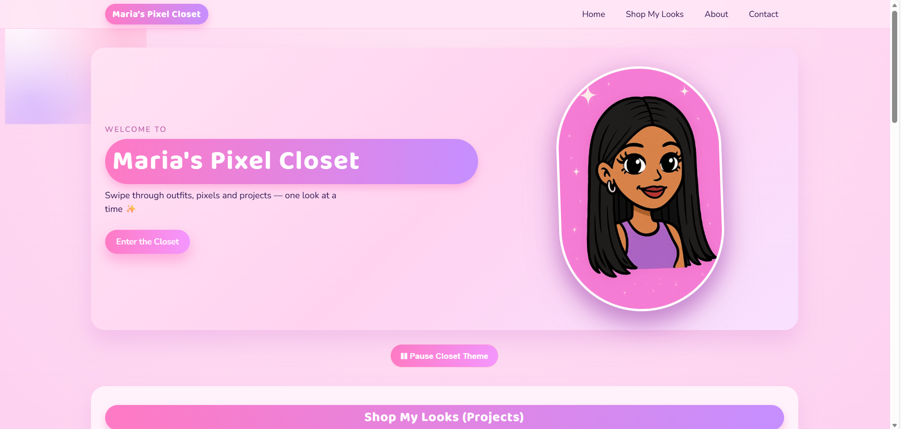
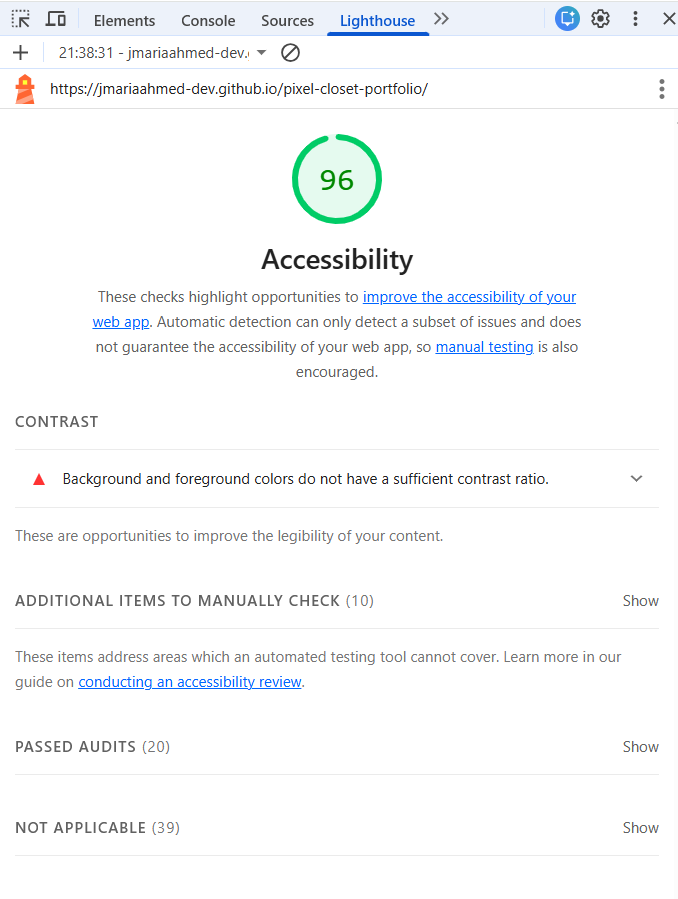
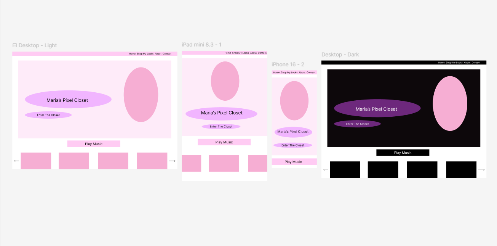
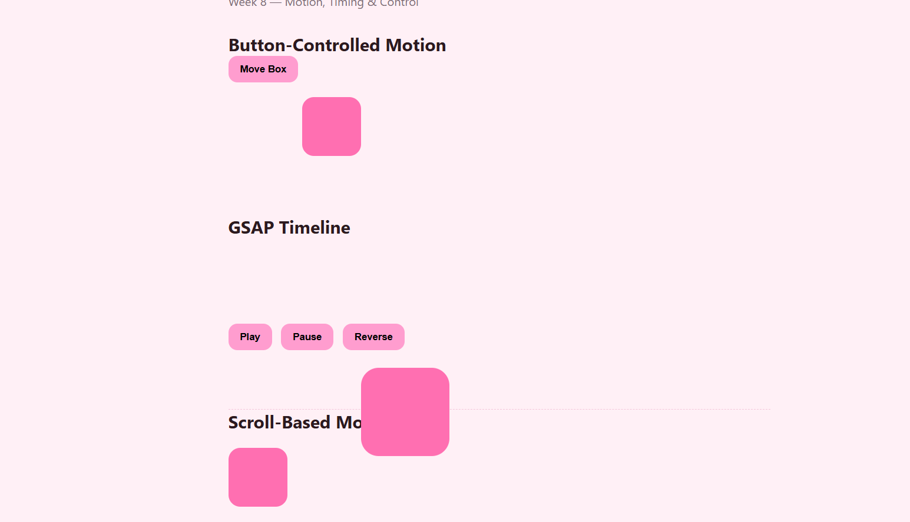
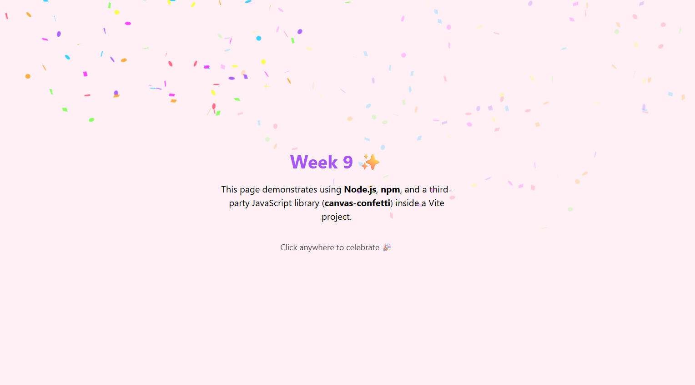

# Maria’s Pixel Closet – Portfolio Documentation  
**Creative Computing (Year 2) – Web Development Studio**

---

## 1. Project Overview

Maria’s Pixel Closet is a personal, cross-platform portfolio website designed as a playful digital “wardrobe” for presenting weekly creative coding projects.  
The site combines front-end web development techniques with visual design, interaction, and accessibility considerations.

Rather than a traditional portfolio layout, the project frames weekly coursework as “looks” inside a closet, allowing the site itself to act as a creative artefact as well as a container for technical work.

The portfolio was designed and developed using:
- Semantic HTML
- CSS for layout, styling, and responsive design
- JavaScript for interactivity and accessibility features
- Third-party libraries (AOS, canvas-confetti)
- Node.js, npm, and Vite (Week 9)

The website is published online using GitHub Pages, with all weekly tasks accessible directly from the main site.

---

## 2. Design Process & Ideation

Link to website: https://jmariaahmed-dev.github.io/pixel-closet-portfolio/

The visual direction of the project was inspired by:
- early-2000s fashion games
- pastel colour palettes
- playful UI metaphors (closets, outfits, cards)

Design decisions prioritised:
- clarity of navigation
- consistent visual hierarchy
- accessibility across devices (desktop, tablet, mobile)

The homepage introduces the project concept, while the “Weekly Journey” section allows users to navigate directly to individual weekly tasks.

---

## 3. Accessibility Evaluation

### 3.1 Lighthouse Accessibility Audit

Accessibility was evaluated using the Chrome DevTools Lighthouse audit, focusing on the **Accessibility** category.

The audit checks:
- semantic HTML structure
- colour contrast ratios
- image alternative text
- ARIA labels
- keyboard navigation support

The website achieved a **high accessibility score**, indicating strong compliance with WCAG 2.1 guidelines.

### 3.2 Implemented Accessibility Features

Key accessibility features include:
- Semantic HTML elements (`header`, `nav`, `main`, `section`, `footer`)
- A visible **“Skip to main content”** link for keyboard and screen-reader users
- Alt text provided for all meaningful images
- ARIA labels on navigation and interactive controls
- Keyboard-accessible navigation and buttons
- Clear visual focus states
- Responsive layout to support different screen sizes

### 3.3 Accessibility Reflection

While the site performs well in automated testing, accessibility could be further improved by:
- testing with screen reader software (NVDA / VoiceOver)
- providing reduced-motion options for animated content
- adding explicit focus indicators for all interactive elements

---

## 4. Weekly Task Documentation

## Week 1 – HTML Starter Fit

Week 1 focused on core HTML structure and semantic markup.  
This task established the foundation for later work by reinforcing best practices such as proper heading hierarchy, meaningful element choice, and accessible document structure.

Learning outcomes:
- understanding semantic HTML
- structuring content clearly
- preparing markup for future styling and interactivity

---

## Week 2 – Hyperlink Time Machine

Week 2 explored hyperlinking and navigation through creative use of links.  
The task demonstrated how linking can be used not only for navigation, but also as an interactive storytelling device.

Learning outcomes:
- internal and external linking
- navigation logic
- user flow and orientation

---

## Week 3 – CSS Self-Portrait

This week focused on expressive CSS styling.  
A self-portrait was created using CSS properties such as positioning, borders, colours, and typography.

Learning outcomes:
- CSS layout fundamentals
- visual styling without images
- translating visual ideas into code

---

## Week 4 – Layouts & Responsive Design

Week 4 introduced responsive design principles.  
The task explored how layouts adapt across screen sizes using flexible units and media queries.

Learning outcomes:
- responsive layout techniques
- mobile-first thinking
- cross-platform design awareness

---

## Week 5 – Design & Accessibility (Figma)

Link to figma project: https://www.figma.com/design/MGcf03JXj8sb3tazIYHyxD/Untitled?node-id=0-1&p=f&t=znjmNpATG748Y79s-0

Week 5 focused on design planning and accessibility.  
The interface was first designed in Figma, allowing layout and hierarchy decisions to be tested before implementation.

The Figma design was linked directly from the portfolio rather than rebuilt in code, demonstrating that non-coded design work can still form part of a technical portfolio.

Learning outcomes:
- UI planning and wireframing
- accessibility-aware design decisions
- connecting design tools with web projects

---

## Week 6 – DOM & Interactions

Week 6 introduced JavaScript DOM manipulation.  
Interactive elements were enhanced through event listeners and dynamic behaviour, improving user engagement.

Learning outcomes:
- selecting and manipulating DOM elements
- handling user events
- separating structure, style, and behaviour

---

## Week 7 – Events & UX

This week built on interaction design, focusing on user experience.  
JavaScript events were used to provide feedback and improve usability.

Learning outcomes:
- event-driven programming
- UX-focused interaction design
- refining interactivity based on user behaviour

---

## Week 8 – Motion & Animation

Week 8 explored animation and motion using JavaScript libraries.  
Motion was used to guide attention and create a more engaging interface without overwhelming the user.

Learning outcomes:
- integrating third-party libraries
- understanding animation timing
- balancing aesthetics with usability

---

## Week 9 – Node.js, npm & Vite

Week 9 introduced modern JavaScript tooling, including Node.js, npm, and Vite.

Key steps included:
- setting up a Vite project
- installing a third-party library (`canvas-confetti`) using npm
- importing the library into `main.js`
- handling click events to trigger confetti at the mouse position

### Challenges & Resolution

A key challenge was that the confetti effect worked in development mode but failed after building the project.

This was resolved by:
- correctly running `npm run build`
- uploading the generated `dist` folder rather than source files
- ensuring relative paths were preserved when deploying to GitHub Pages

This process improved understanding of build pipelines and deployment workflows.

---

## Week 10 – Three.js Introduction

Week 10 introduced Three.js and 3D graphics concepts.  
A simple scene was created using primitives and rendered in the browser.

Learning outcomes:
- understanding real-time 3D rendering
- using Three.js primitives
- integrating 3D content into web projects

---

## 5. Technical Summary

Technologies used across the project:
- HTML5 (semantic structure)
- CSS3 (layout, styling, responsiveness)
- JavaScript (interactivity, accessibility)
- Node.js & npm (dependency management)
- Vite (development server and build tool)
- canvas-confetti (third-party JS library)
- GitHub Pages (deployment)

---

## 6. Reflection

Maria’s Pixel Closet represents the culmination of my learning across the Web Development Studio unit, bringing together technical skills, creative practice, and reflective development into a cohesive, accessible portfolio website.

Across the term, I progressed from foundational HTML structure and hyperlink-based navigation to more advanced front-end concepts including responsive layouts, JavaScript-driven interactivity, animation libraries, and modern development tooling. Each weekly task contributed a distinct skillset, which is preserved both as individual experiments and as part of the wider portfolio system. This approach allowed me to demonstrate consistent learning progression while maintaining a unified visual and conceptual identity.

The final website demonstrates good practice in semantic HTML, modular CSS styling, and JavaScript used purposefully for interaction, animation, and accessibility. Accessibility was considered throughout the design and development process, with features such as keyboard navigation, ARIA labels, alt text, and clear visual hierarchy. Evaluation using Lighthouse confirmed a high accessibility score, while reflective analysis identified areas for potential future improvement.

Working with tools such as Figma, GSAP, Three.js, and Node.js (via npm and Vite) strengthened my understanding of modern front-end workflows and the role of third-party libraries in enhancing user experience. Challenges encountered during development — particularly when integrating build tools and external libraries - became valuable learning moments that improved my debugging skills and confidence working with documentation.

Overall, this project reflects both my technical growth and my interest in blending creative aesthetics with interactive web design. Maria’s Pixel Closet functions not only as an assessment submission, but as a flexible portfolio framework that I can continue to expand beyond this unit.

## References

## Code & Learning Resources References

The following external libraries and documentation were used throughout this project.  
All implementations were adapted and integrated into my own code structure.

- AOS (Animate On Scroll)  
  https://michalsnik.github.io/aos/

- canvas-confetti  
  https://www.npmjs.com/package/canvas-confetti

- Three.js  
  https://threejs.org/docs/

- MDN Web Docs (HTML, CSS, JavaScript reference)  
  https://developer.mozilla.org/

- GSAP Documentation  
  https://greensock.com/docs/

